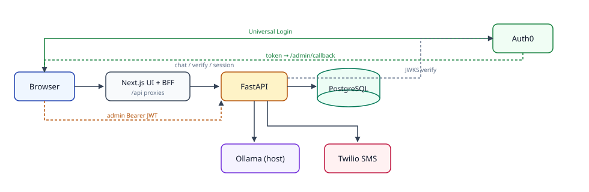
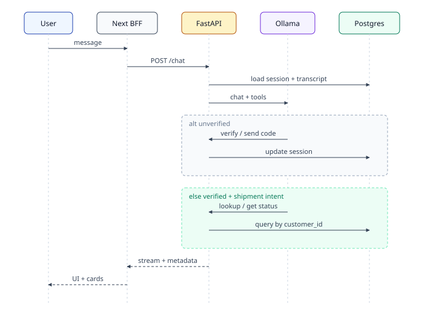

# SecureShip Architecture

SecureShip is an **AI-gated shipment support chat**: customers verify identity conversationally (name, phone, SMS 2FA), then a **local Ollama** model may call tools that read shipment data scoped to `session.customer_id`. Admins manage the shipment DB through an Auth0-gated panel.

## System overview

## Trust boundaries

| Boundary | Who | What is trusted |
|----------|-----|-----------------|
| **Customer session** | Chat user | Opaque `session_id` (UUID). Shipment tools trust only server-set `session.customer_id` after SMS verification — never a client-supplied customer id. |
| **Admin JWT** | Operators | Auth0 access token audience/issuer/signature. Separate from customer sessions. |
| **BFF** | Next.js server | `BACKEND_API_URL` stays server-side for chat proxies. Admin still needs a browser-reachable backend URL for CRUD. |
| **Prompt** | Soft boundary | System prompt steers the model; **tools enforce the hard gate**. |

## Conversational identity → tools

## Two-tool shipment design

| Tool | Args | Behavior |
|------|------|----------|
| `lookup_shipments` | none | All non-deleted shipments for `session.customer_id` |
| `get_shipment_status` | `tracking_number` | One ownership-scoped row (or not_found) |
| `get_shipment_details` | `shipment_id` | Details + packages; id must come from a prior tool result |

Forced routing in `chat.py`: if the user message contains a tracking-like token → `get_shipment_status`; else shipment-intent → `lookup_shipments`.

Frontend may still receive a multi-shipment list in metadata; `filterShipmentsForDisplay` shows one card + “Show all” when exactly one tracking is mentioned.

## Escalation theater

`escalate_to_human` flips session state. The UI plays a scripted “agent joined” sequence. **No extra data access** — tools remain gated the same way; theater must not leak shipment PII.

## Key components

| Path | Role |
|------|------|
| `backend/src/secureship/main.py` | Routes, CORS, rate limit, validation |
| `backend/src/secureship/chat.py` | System prompt, Ollama loop, forced tools |
| `backend/src/secureship/tools.py` | Tool schemas + execution + ownership gates |
| `backend/src/secureship/auth.py` | Auth0 JWT for admin |
| `frontend/src/components/ChatWindow.tsx` | Chat UX, cards, a11y |
| `frontend/src/pages/api/*` | BFF proxies |

## Diagrams

- [diagrams/architecture.md](diagrams/architecture.md) — Compose / host layout
- [diagrams/chat-flow.md](diagrams/chat-flow.md) — HTTP chat + metadata
- [diagrams/tool-gate.md](diagrams/tool-gate.md) — ownership gate
- [diagrams/escalation.md](diagrams/escalation.md) — escalation theater

## Related

- [API.md](API.md) · [SECURITY.md](SECURITY.md) · [DEPLOYMENT.md](DEPLOYMENT.md) · [CLAUDE.md](../CLAUDE.md)
