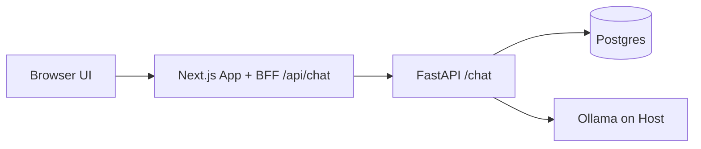

# SecureShip Architecture

## Notes

- Ollama runs on the macOS host and is reached from Docker containers through `host.docker.internal`.
- The browser never calls FastAPI directly; it uses the Next.js BFF route.
- FastAPI persists chat transcripts in Postgres keyed by `session_id`.
