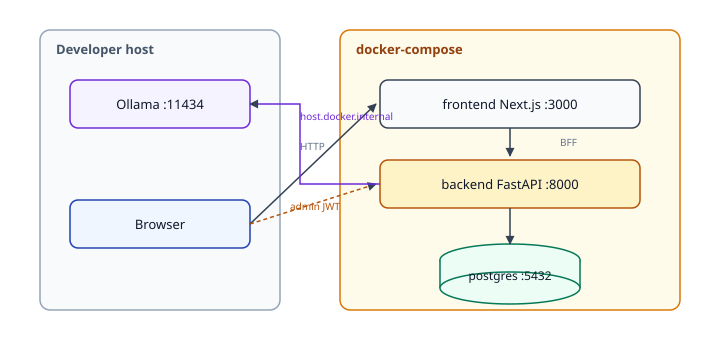

# Diagrams — Compose & host layout

## Notes

- Ollama runs on the **host**, not in Compose (program stretch to containerize).
- Backend Compose service sets `OLLAMA_HOST=http://host.docker.internal:11434`.
- Frontend bind-mounts source for hot reload in local Compose; production images are separate (Week 5 DevOps).
- Chat path: browser → Next BFF → FastAPI. Admin path: browser → FastAPI with Bearer token.

See also [ARCHITECTURE.md](../ARCHITECTURE.md).
