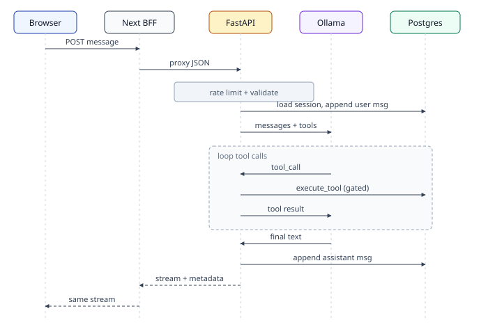

# Diagrams — Chat HTTP flow



## Metadata channel

After streamed UTF-8 text, the backend writes a null byte (`\x00`) then JSON roughly:

```json
{ "s": "verified", "sid": "<uuid>", "shipment": { "tool": "…", "data": { … } } }
```

The BFF and `streamChat()` strip the metadata from display text and return it to the UI.
